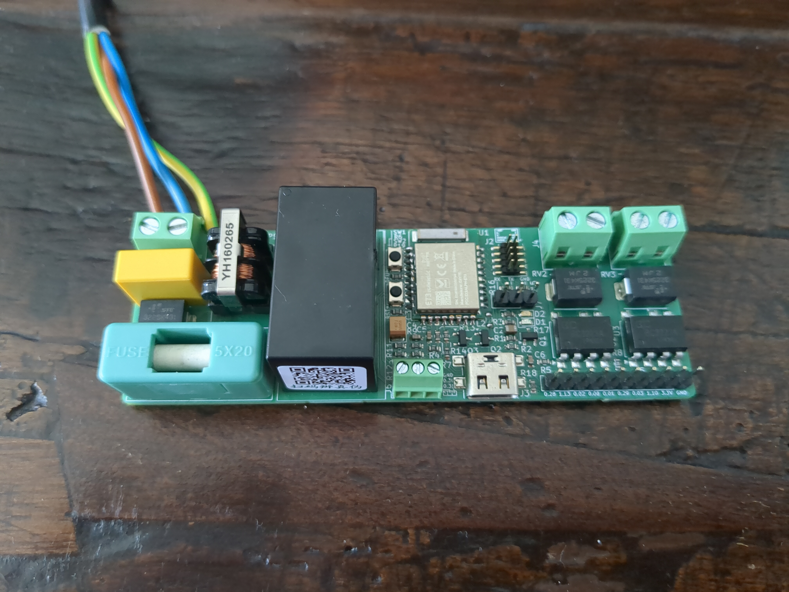
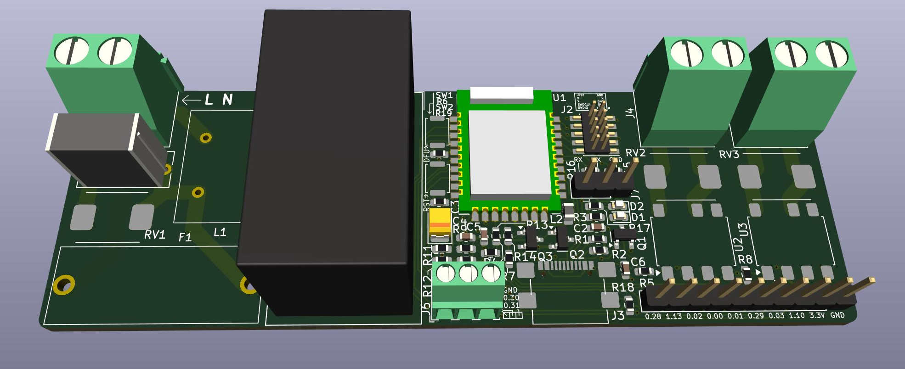

# ZigShutter

ZigShutter is a platform for the control of window shutters and IAS.

It features:
 * ZigBee connectivity through a nRF52840 module
 * AC power supply
 * Control of two outputs with SSR, to control the two directions of a window shutter motor
 * Two inputs for window opening sensors
 * Eight GPIOs

